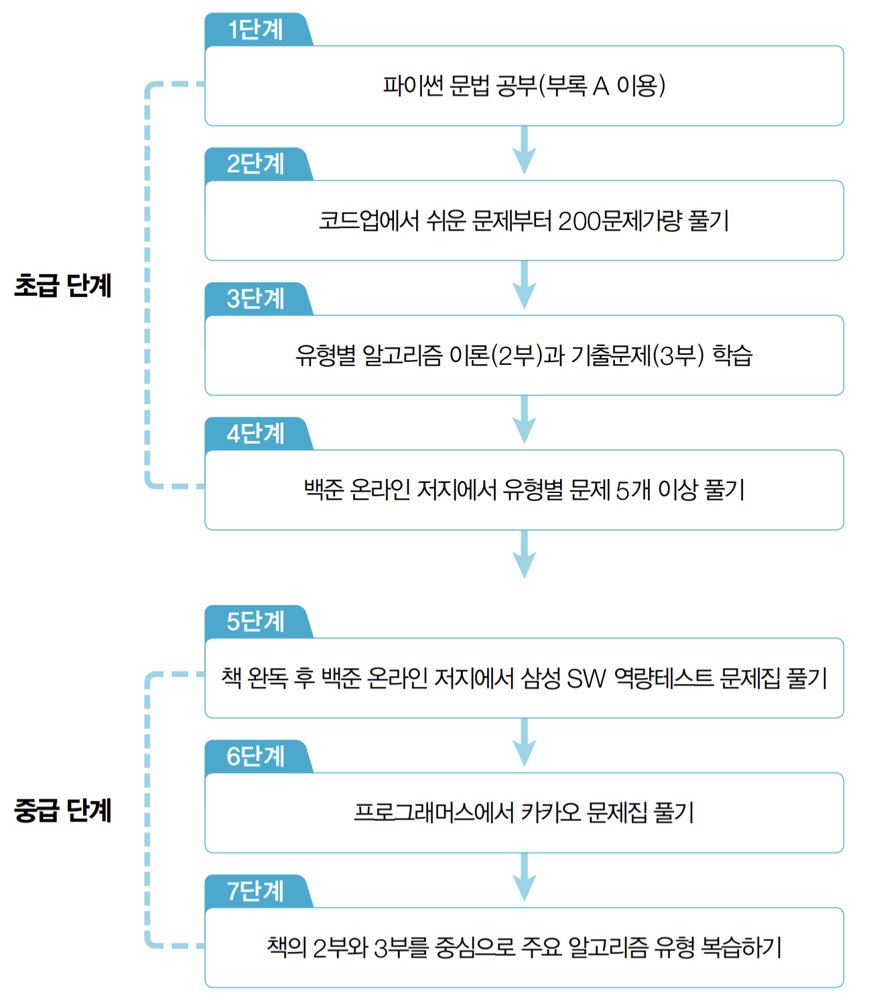

# Study notes for coding test with Python
Python 코딩테스트 스터디 노트입니다.😀 

## 참고 자료
- 🔗 [M1 Mac conda miniforge 셋업](https://hmfactory.tistory.com/26)
- 🔗 [코딩테스트 대비 공부방법 (파이썬)](https://in0-pro.tistory.com/51)
- 🔗 [알고리즘 대기업 코딩 테스트 공부방법](https://firesoil-it.tistory.com/28)

## 계획
- 참고 도서: [이것이 취업을 위한 코딩 테스트다 with 파이썬](http://www.yes24.com/Product/Goods/91433923)
- 본 참고도서에서 추천하는 학습 순서를 따르고자 합니다.

  

### 1 Miniforge conda 환경 셋업
- 코딩 테스트에 가상 환경 셋업 까진 필요 없을 것 같으나, 미래에 이것 저것 생각해서..😂
- 완료일: 22. 03. 31

### 2 부록 A 코딩테스트를 위한 파이썬 문법
- 🔗 [스터디 노트](https://be-favorite.github.io/Study_coding/Basic_for_codingtest/study_note_encrypted.html) (완료일: 22. 04. 27)

### 3 코드업에서 쉬운 문제부터 200문제가량 풀기
- 🔗 [코드업](https://codeup.kr/index.php)
- 기초 100제
- 간단한 문제 위주 100문제
